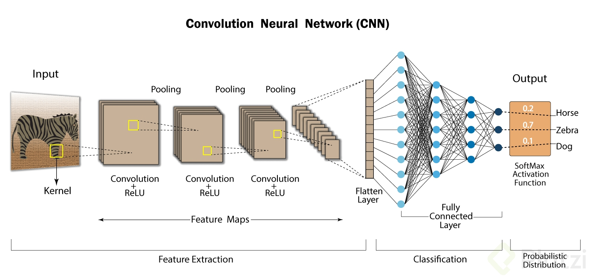

#deep learning

- Herramientas: pyTorch y TensorFlow
- Subcategoría de ML que crea diferentes niveles, de abstracción que representa los datos.
- Se usan tensores para representar estructuras de datos más complejas.
- Neuronas: Capa de entrada, capas ocultas y capa de salida.
- Para poder aprender se necesita una función de activación: ReLU: Permite el paso de todos los valores positivos sin cambiarlos, pero asigna todos los valores negativos a 0.
- TensorFlow: Biblioteca de código abierto desarrollado por google, capaz de construir y entrenar redes neuronales.

##-

- El aprendizaje profundo no es un tema nuevo, data de los años 50 aproximadamente pero su uso se ha popularizado debido a la existencia de librerias como TensorFlow (Desarrollador por Google) y pyTorch (Desarrollador por Facebook).
- Gracias a las redes neuronales ahora los inputs no necesariamente tienen que ser datos, también pueden ser audios e imágenes.
- Es una subcategoría de ML que crea diferentes niveles, de abstracción que representa los datos y se centra en encontrar similitudes o patrones. Utilizamos tensores para representar estructuras de datos más complejas.
- Los fundamentos se encuentran en las neuronas. Las redes neuronales artificiales estan basadas en las conexiones neuronales divididas en capas de aprendizaje, estas son: Capa de entrada, capas ocultas y capa de salida.
- Para poder aprender se necesita una función de activación, utilizaremos ReLU, aunque existen otras. ReLu permite el paso de todos los valores positivos sin cambiarlos, pero asigna todos los valores negativos a 0.

#Conceptos básicos de Tensor Flow

Tensor Flow es una biblioteca de software de código abierto que permite construir y entrenar redes neuronales, permite detectar y descifrar patrones en los datos. Es un desarrollo de Google y que debido a su flexibilidad y extensa comunidad de programadores ha crecido rápidamente y se ha posicionado como la herramienta líder en el estudio del aprendizaje profundo o también conocido como Deep Learning.

Tensor Flow puede ser usado para ayudar al diagnóstico médico, detectar objetos, procesar imágenes, detección de emociones en el rostro, entre otras aplicaciones. En este curso usamos Tensor Flow para crear nuestra primera red neuronal y diseñar un clasificador de imágenes a partir de un conjunto de datos.

Importar la biblioteca:
import tensorflow as tf

Importar el modelo:
from tensorflow import keras

Cargar conjunto de datos de Tensor Flow:
fashion_mnist = keras.datasets.fashion_mnist
(train_images, train_labels), (test_images, test_labels) = fashion_mnist.load_data()

Crear modelo secuencial:
model = keras.Sequential([keras.layers.Flatten(input_shape = (28, 28)), keras.layers.Dense(128, activation = tf.nn.relu), keras.layers.Dense(10, activation = tf.nn.softmax)])

Compilación del modelo:
model.compile(optimizer = tf.optimizers.Adam(), loss = ‘sparse_categorical_crossentropy’, metrics = [‘accuracy’])

Entrenamiento:
model.fit(train_images, train_labels, epochs = 5)

Evaluación del modelo:
test_loss, test_acc = model.evaluate( test_images, test_labels )

Predicción del modelo:
model.predict(test_images)

básicamente cada capa capta cierto atributos de la imagen, generalmente las primeras captan “bordes” , pero entre mas profunda la red capta caracteristicas mas complejas. En si aplicar una convolucion resulta en aplicar una matriz de numeros a la imagende input vista igualmente como una matriz de números. donde dichos numeros hacen referencia a los pixeles de la misma que van de 0 a 256. El tema es valga la redundancia muy profundo pero espero el comentario sirva a algunos.

https://www.tensorflow.org/tutorials/keras/classification
