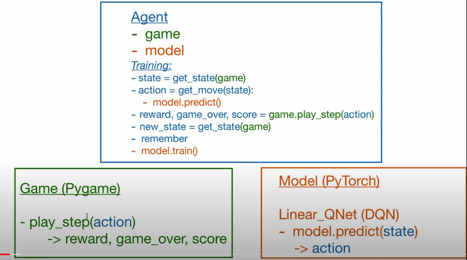
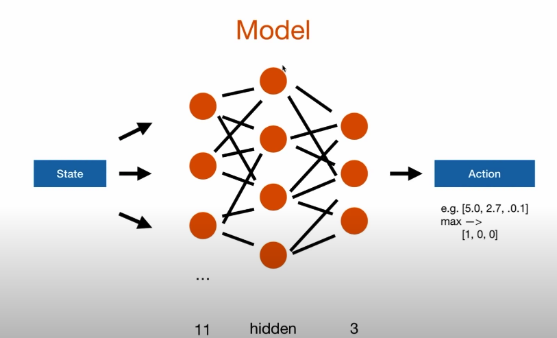

# Reinforcement Learning

Enseñar a un agente como sobrevivir y mejorar en cada acción

## Deep Q learning

Enseñar por medio de una red neuronal

Action

[1,0,0] -> straight
[0,1,0] -> right turn
[0,0,1] -> left turn

State (11 values)

danger straight, danger right, danger left

direction left, direction right, direction up, direction down

food left, food right, food up, food down

### model

11 state -> model -> 3 actionå

### (Deep)Q Learning

Q Value = Quality of action

0. Init Q value (= init model)
1. choose action (model.predict(state))
2. perform action
3. measure reward
4. update Q value (+ train model) **repeat 1**

Bellman Equation
NewQ(s,a) = Q(s,a) + ∞[R(s,a) + ¥maxQ'(s',a') - Q(s,a)]
∞ = learning rate
¥ = discount rate

#### Q update rule

Q = model.predict(state0)
Qnew = R + ¥max(Q(state1))

#### loss function

loss = (Qnew - Q)^2
